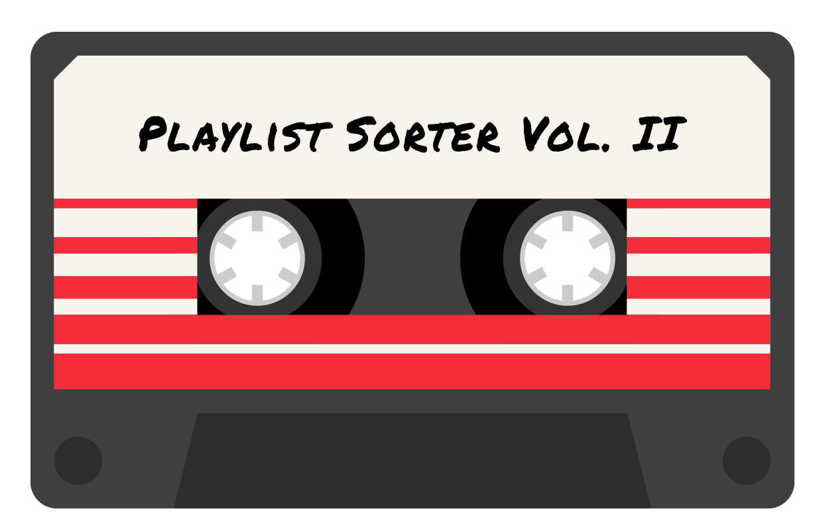
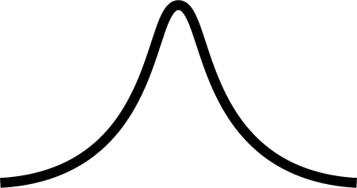

  

[Live version of the project](http://mixtape-maker.xyz)

There's no better feeling than being completely *immersed* in a good playlist. The key to creating an immersive playlist is having thoughtful flow between songs. Having bad flow between songs completely breaks the immersion and overall vibe that a playlist is trying to establish. For example, [*Good Vibrations*](https://open.spotify.com/track/5t9KYe0Fhd5cW6UYT4qP8f?si=LSOjru8ORumZs2pSc97nQA) by The Beach Boys and [*Triumph*](https://open.spotify.com/track/3glqlA5qY3bbo8UaUDGPnw?si=58Rixp_7T9a2ZwY_UEj7Zg) by Wu-Tang are both great songs, but by no means should they be played back to back—that would be musical whiplash. Therefore, the goal of this playlist sorter is to help you create playlists with better flow and structure.

## Vol. II
This is the second iteration of the Playlist Sorter—cleaner, more design focused, and built in React.js. The first iteration was a barebones prototype—a live preview of which can be viewed [here](http://onrepeat.xyz/playlist-sorter.html).

## How It Works
Using the Spotify API, each song in a playlist is analyzed and broken up into a bunch of different `features`. The `features` we're going to look at are:

| Feature | Description |
|:-------:|:------------|
| Acousticness | A confidence measure from 0.0 to 1.0 of whether the track is acoustic. 1.0 represents high confidence the track is acoustic.|
| Danceability | Danceability describes how suitable a track is for dancing based on a combination of musical elements including tempo, rhythm stability, beat strength, and overall regularity. A value of 0.0 is least danceable and 1.0 is most danceable. |
| Energy | Energy is a measure from 0.0 to 1.0 and represents a measure of intensity and activity. Typically, energetic tracks feel fast, loud, and noisy. For example, death metal has high energy, while Mozart scores low on the scale. |
| Tempo | The overall estimated tempo of a track in beats per minute (BPM). Tempo is the speed or pace of a given piece. |
| Mood | A measure from 0.0 to 1.0 describing the musical positiveness conveyed by a track. Tracks with high mood sound more positive (happy, cheerful, blissful), while tracks with low mood sound more negative (sad, depressed, angry). |

The `features` can then be used to sort the playlist into a variety of different shapes. These shapes can also be inverted (turning the peak into a trough). The Possible shapes are:

|Name|Shape|Inverse|
|:-:|:-:|:-:|
|Up|  |  |
|Down|  |  |
|Bell|  |  |
|Left Skew*|  |  |
|Right Skew*|  |  |

## Use Cases
**Party**
An example of a good time to use the playlist sorter would be when you're throwing a party. Obviously you don't want to play your most danceable songs as soon as the party start. You want to get everyone's hips gyrating when the party is peaking! After that, you want the music to slow back down—subtly telling your guests to *get out*. Therefore, a right skewed curve based on danceability would be the most fitting.

**Studying**
The goal of any good studying playlist is to keep you concentrated. Going from a slow, calm song to a fast, aggressive song can definitely break that concentration. Therefore, a downward energy curve would be fitting—it'll slowly ease you into *the zone*.
